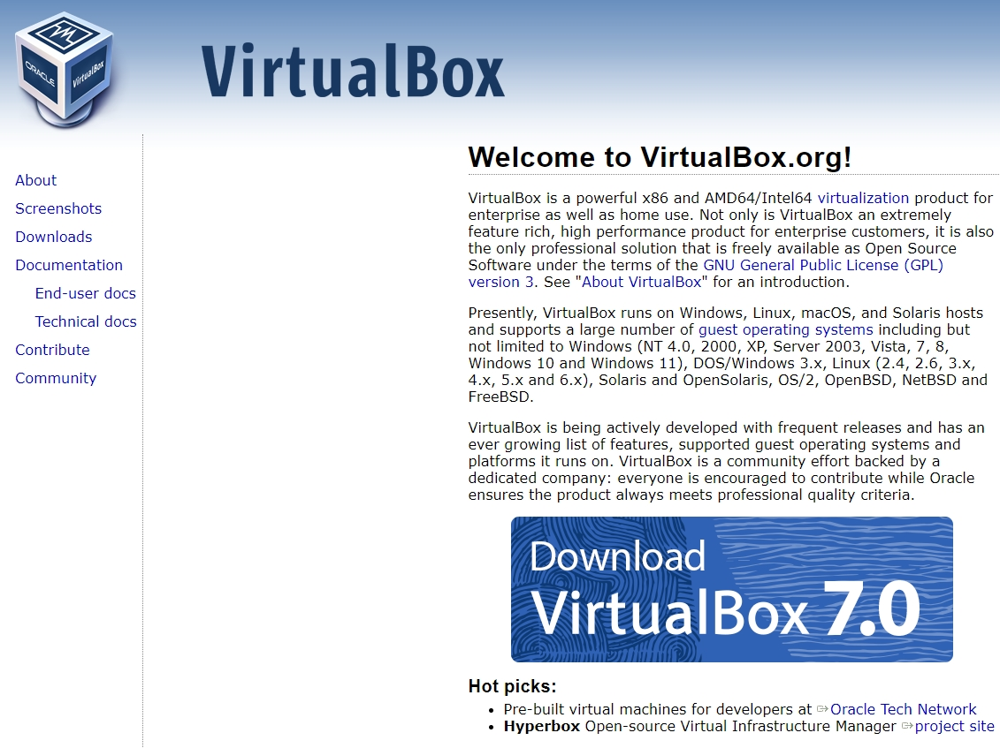
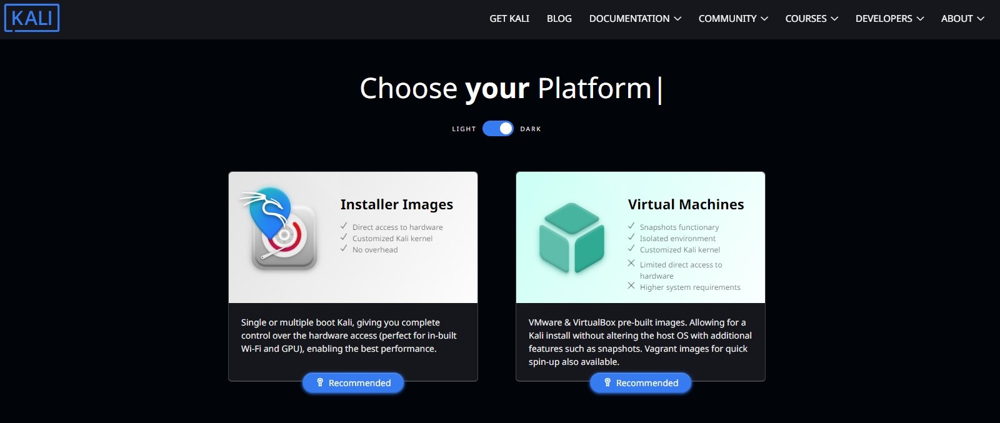
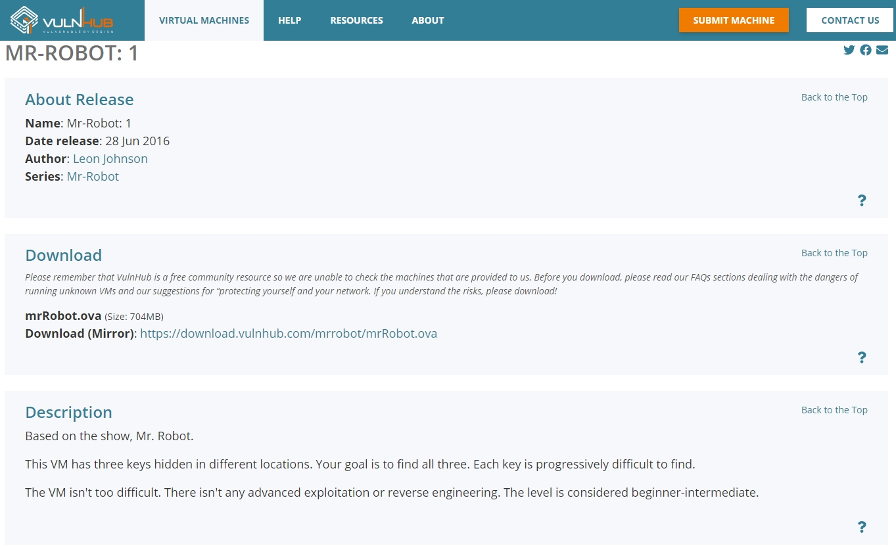
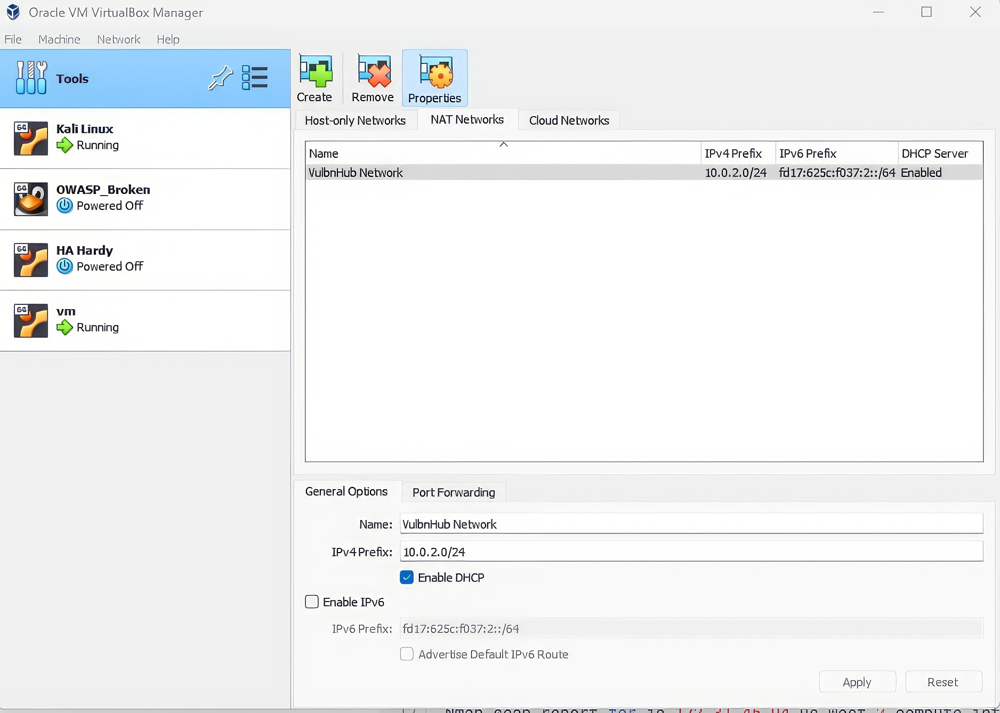
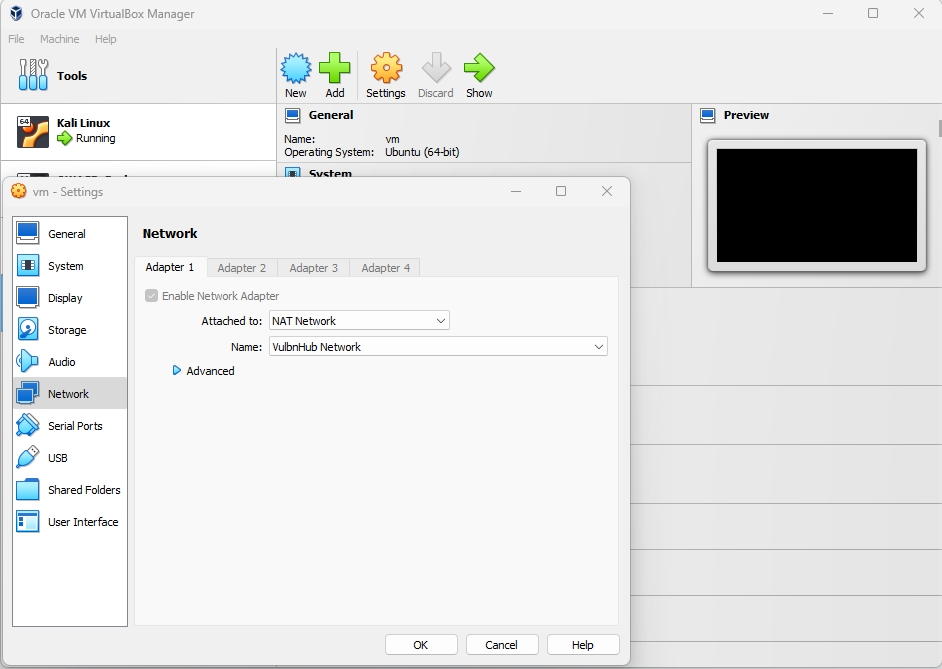
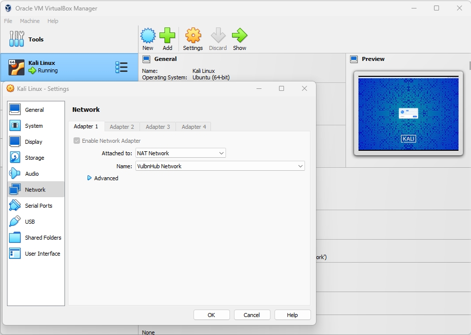
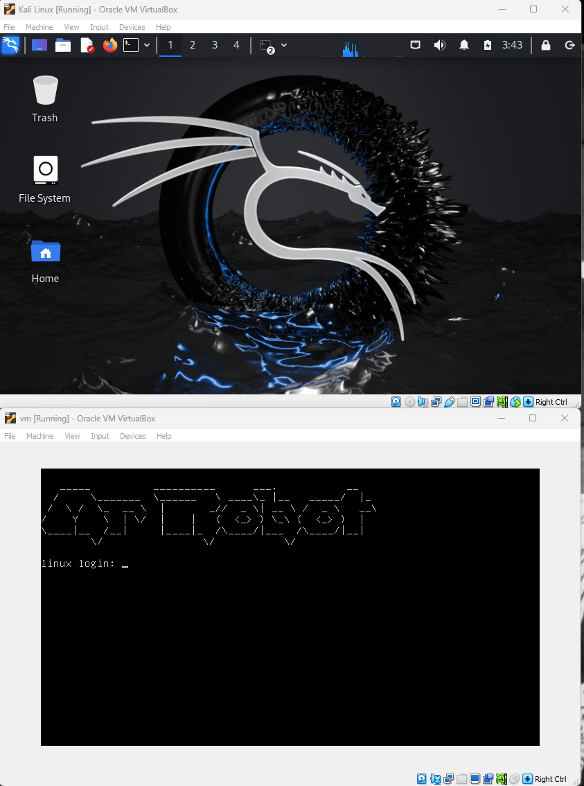

# **Step 1: Set Up Environment**

!!! note ""

- Download and Install VirtualBox.

- Download Kali Linux VM

- Download Mr. Robot VM from VulnHub.

- Import Kali and  Mr. Robot VM into VirtualBox
- Create a VM’s  NAT Network.

- Sep up  the network adapter to “NAT Network” mode in both VM.

- Start Kali and Mr Robot VM using VirtualBox Console.

<noscript>Please enable JavaScript to view the <a href="https://disqus.com/?ref_noscript">comments powered by Disqus.</a></noscript>

!!! note ""

<a href="/Career-Simulation-3/2-instructions/" class="md-button md-button--primary">Previous: Introduction</a>
<a href="/Career-Simulation-3/" class="md-button md-button--secondary">Home 🏠</a>
<a href="/Career-Simulation-3/challenge_2/" class="md-button md-button--primary">Next: Step 2</a>

