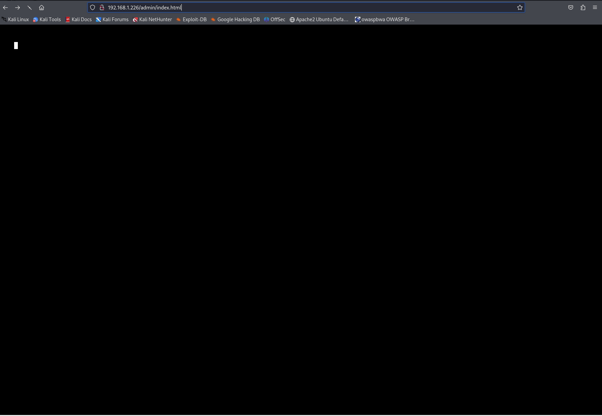

# **Step 3: Enumeration**
!!! note ""

## Gobuster

- Use  gobuster to find hidden directories and files.

```python linenums="1" hl_lines="38 44"
┌──(hcoco1㉿kali)-[~]
└─$ gobuster dir -u http://192.168.1.226 -w /usr/share/wordlists/dirb/common.txt

===============================================================
Gobuster v3.6
by OJ Reeves (@TheColonial) & Christian Mehlmauer (@firefart)
===============================================================
[+] Url:                     http://192.168.1.226
[+] Method:                  GET
[+] Threads:                 10
[+] Wordlist:                /usr/share/wordlists/dirb/common.txt
[+] Negative Status codes:   404
[+] User Agent:              gobuster/3.6
[+] Timeout:                 10s
===============================================================
Starting gobuster in directory enumeration mode
===============================================================
/.hta                 (Status: 403) [Size: 213]
/.htaccess            (Status: 403) [Size: 218]
/.htpasswd            (Status: 403) [Size: 218]
/0                    (Status: 301) [Size: 0] [--> http://192.168.1.226/0/]
/admin                (Status: 301) [Size: 235] [--> http://192.168.1.226/admin/]
/atom                 (Status: 301) [Size: 0] [--> http://192.168.1.226/feed/atom/]
/audio                (Status: 301) [Size: 235] [--> http://192.168.1.226/audio/]
/blog                 (Status: 301) [Size: 234] [--> http://192.168.1.226/blog/]
/css                  (Status: 301) [Size: 233] [--> http://192.168.1.226/css/]
/dashboard            (Status: 302) [Size: 0] [--> http://192.168.1.226/wp-admin/]
/favicon.ico          (Status: 200) [Size: 0]
/feed                 (Status: 301) [Size: 0] [--> http://192.168.1.226/feed/]
/image                (Status: 301) [Size: 0] [--> http://192.168.1.226/image/]
/images               (Status: 301) [Size: 236] [--> http://192.168.1.226/images/]
/Image                (Status: 301) [Size: 0] [--> http://192.168.1.226/Image/]
/index.html           (Status: 200) [Size: 1188]
/index.php            (Status: 301) [Size: 0] [--> http://192.168.1.226/]
/intro                (Status: 200) [Size: 516314]
/js                   (Status: 301) [Size: 232] [--> http://192.168.1.226/js/]
/license              (Status: 200) [Size: 19930]
/login                (Status: 302) [Size: 0] [--> http://192.168.1.226/wp-login.php]
/page1                (Status: 301) [Size: 0] [--> http://192.168.1.226/]
/phpmyadmin           (Status: 403) [Size: 94]
/readme               (Status: 200) [Size: 7334]
/rdf                  (Status: 301) [Size: 0] [--> http://192.168.1.226/feed/rdf/]
/robots               (Status: 200) [Size: 41]
/robots.txt           (Status: 200) [Size: 41]
/rss                  (Status: 301) [Size: 0] [--> http://192.168.1.226/feed/]
/rss2                 (Status: 301) [Size: 0] [--> http://192.168.1.226/feed/]
/sitemap              (Status: 200) [Size: 0]
/sitemap.xml          (Status: 200) [Size: 0]
/video                (Status: 301) [Size: 235] [--> http://192.168.1.226/video/]
/wp-admin             (Status: 301) [Size: 238] [--> http://192.168.1.226/wp-admin/]
/wp-content           (Status: 301) [Size: 240] [--> http://192.168.1.226/wp-content/]
/wp-config            (Status: 200) [Size: 0]
/wp-includes          (Status: 301) [Size: 241] [--> http://192.168.1.226/wp-includes/]
/wp-cron              (Status: 200) [Size: 0]
/wp-load              (Status: 200) [Size: 0]
/wp-links-opml        (Status: 200) [Size: 228]
/wp-mail              (Status: 403) [Size: 3018]
/wp-settings          (Status: 500) [Size: 0]
/wp-signup            (Status: 302) [Size: 0] [--> http://192.168.1.226/wp-login.php?action=register]
/wp-login             (Status: 200) [Size: 2689]
/xmlrpc               (Status: 405) [Size: 42]
/xmlrpc.php           (Status: 405) [Size: 42]
Progress: 4614 / 4615 (99.98%)
===============================================================
Finished
===============================================================


```


>The gobuster scan revealed several interesting directories and files on the target web server. 

### Findings
- /admin (Status: 301) -> Redirects to /admin/
- /dashboard (Status: 302) -> Redirects to /wp-admin/
- /login (Status: 302) -> Redirects to /wp-login.php
- /robots.txt (Status: 200) -> Contains entries which should be hidden
- /wp-admin (Status: 301) -> Redirects to /wp-admin/
- /wp-content (Status: 301) -> Redirects to /wp-content/
- /wp-config (Status: 200) -> Empty, but interesting as it is usually sensitive
- /wp-login.php (Status: 200) -> WordPress login page

  >Based on the output  provided from  `gobuster` command, we can see that the Target VM contains a Wordpress Site.


- Examine /robots.txt File:

```python linenums="1" hl_lines="5 6"
┌──(hcoco1㉿kali)-[~]
└─$ curl http://192.168.1.226/robots.txt

User-agent: *
fsocity.dic
key-1-of-3.txt
```

- Download and Inspect fsocity.dic

```python linenums="1" hl_lines="9"
┌──(hcoco1㉿kali)-[~]
└─$ curl -O http://192.168.1.226/fsocity.dic

  % Total    % Received % Xferd  Average Speed   Time    Time     Time  Current
                                 Dload  Upload   Total   Spent    Left  Speed
100 7075k  100 7075k    0     0  8409k      0 --:--:-- --:--:-- --:--:-- 8413k
                                                                                                                                                  ┌──(hcoco1㉿kali)-[~]
└─$ wc -l fsocity.dic
858160 fsocity.dic
                            
┌──(hcoco1㉿kali)-[~]
└─$ head fsocity.dic                        
true
false
wikia
from
the
now
Wikia
extensions
scss
window

```

>Since the fsocity.dic file is too long, it’s practical to preprocess it before using it in brute-force attacks


```python linenums="1" hl_lines="8"
┌──(hcoco1㉿kali)-[~]
└─$ sort fsocity.dic | uniq > fsocity_sorted_unique.dic

                                                                                                                                                                               
┌──(hcoco1㉿kali)-[~]
└─$ wc -l fsocity_sorted_unique.dic

11451 fsocity_sorted_unique.dic

```

- Download and Inspect key-1-of-3.txt

```bash linenums="1" hl_lines="11"
┌──(hcoco1㉿kali)-[~]
└─$ curl -O http://192.168.1.226/key-1-of-3.txt

  % Total    % Received % Xferd  Average Speed   Time    Time     Time  Current
                                 Dload  Upload   Total   Spent    Left  Speed
100    33  100    33    0     0   5897      0 --:--:-- --:--:-- --:--:--  6600
                                                                                                                                                                               
┌──(hcoco1㉿kali)-[~]
└─$ cat key-1-of-3.txt

073403c8a58a1f80d943455fb30724b9 # Flag 1 of 3 ✔️


```
> Flag 1 was found.

### Testing directories


   - http://192.168.1.226:80 

   <video width="720" height="640" controls>
  <source src="https://hcoco1-website-bucket-12345.s3.amazonaws.com/mrrobot.mp4" type="video/mp4">
  Your browser does not support the video tag.
</video>

-  Access /admin, /wp-admin, and /login Directories

    - http://192.168.1.226/admin/ &  http://192.168.1.226/wp-admin/




   - http://192.168.1.226/wp-login.php


## Wappalyzer

### Key Technologies 

- URL: http://192.168.1.226
- CMS: WordPress
- Analytics: WordPress
- Font Scripts: Google Font API
- Programming Languages: PHP
- Databases: MySQL

### Analysis 

#### Content Management System (CMS)

WordPress: The site is running on WordPress, which is a popular CMS known for its flexibility and wide range of plugins and themes. However, it also means that the site could be vulnerable to various common WordPress exploits if not properly secured.

#### Programming Languages

PHP: The server-side scripting language used by WordPress. PHP vulnerabilities are common in older versions, so ensuring the latest updates and security patches are applied is crucial.

#### Database

MySQL: The database management system used by WordPress. Securing the database against SQL injection and ensuring proper database configurations and permissions are essential.

#### Font Scripts

Google Font API: This is used to load custom fonts from Google Fonts. While generally not a security risk, it's part of the site's overall technology stack.


<div id="disqus_thread"></div>
<script>
    /**
    *  RECOMMENDED CONFIGURATION VARIABLES: EDIT AND UNCOMMENT THE SECTION BELOW TO INSERT DYNAMIC VALUES FROM YOUR PLATFORM OR CMS.
    *  LEARN WHY DEFINING THESE VARIABLES IS IMPORTANT: https://disqus.com/admin/universalcode/#configuration-variables    */
    /*
    var disqus_config = function () {
    this.page.url = PAGE_URL;  // Replace PAGE_URL with your page's canonical URL variable
    this.page.identifier = PAGE_IDENTIFIER; // Replace PAGE_IDENTIFIER with your page's unique identifier variable
    };
    */
    (function() { // DON'T EDIT BELOW THIS LINE
    var d = document, s = d.createElement('script');
    s.src = 'https://hcoco1-1.disqus.com/embed.js';
    s.setAttribute('data-timestamp', +new Date());
    (d.head || d.body).appendChild(s);
    })();
</script>
<noscript>Please enable JavaScript to view the <a href="https://disqus.com/?ref_noscript">comments powered by Disqus.</a></noscript>

!!! note ""

<div class="button-container" markdown="1">
<a href="/Career-Simulation-4/challenge_2/" class="md-button md-button--primary">Previous: Step 2</a>
<a href="/Career-Simulation-4/" class="md-button md-button--secondary">Home 🏠</a>
<a href="/Career-Simulation-4/challenge_4/" class="md-button md-button--primary">Next: Step 4</a>
</div>